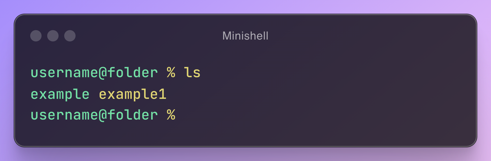

# 🐚 MiniShell - 42Cursus Project

Welcome to **MiniShell**, a simplified Unix shell developed as part of the 42Cursus program. This project is designed to help you understand the inner workings of a shell by implementing basic functionalities from scratch. 🛠️🌟

## ✨ Project Overview

**MiniShell** is a minimalist implementation of a Unix-like shell that replicates basic shell behavior. You will learn the essential components of shell programming, process management, and command parsing while dealing with constraints similar to those found in real-world systems.

### 🎯 Key Objectives:

- Implement a command-line interface that can execute commands like `/bin/ls`, `/bin/echo`, etc.
- Handle essential built-in commands: `cd`, `echo`, `pwd`, `export`, `unset`, `env`, and `exit`.
- Manage processes and signals appropriately (e.g., `Ctrl-C`, `Ctrl-D`, `Ctrl-\`).
- Create an interactive session that allows chaining of commands with pipes (`|`), redirection (`>`, `<`, `<<`, `>>`), and handle environment variables.
- Error handling and edge case management are critical aspects of the project.
  
**Constraints:**
- No usage of external libraries and limits set of standart librairy functions . beyond the ones permitted by the project.
- Implement the logic to avoid memory leaks and errors during execution.

### 📚 Features

- ✅ **Interactive Shell**: Your terminal becomes a playground for executing commands and playing around with different shell features.
- ✅ **Built-in Commands**: `cd`, `echo`, `pwd`, `export`, `unset`, `env`, `exit`.
- ✅ **Pipelines and Redirections**: Support for pipes (`|`), input/output redirection (`>`, `<`, `<<`, `>>`), and environment variable expansion.
- ✅ **Signal Handling**: Properly responds to signals like `Ctrl-C`, `Ctrl-\` and `Ctrl-D`.
- ✅ **Error Management**: Graceful handling of errors and edge cases for robust execution.
- ✅ **Command history** support for shortcut for command history and auto-completion.

## 🛠️ Installation & Compilation Guide

### 📦 Dependencies

Make sure you have the following installed:

- **GCC**: A GNU Compiler for C (version >= 9.3.0).
- **Readline Library**: Used for command-line editing and history functionality.

Install them using:

```bash
# For Ubuntu/Debian
sudo apt-get update
sudo apt-get install gcc libreadline-dev
```

### 🏗️ Compilation

You can compile **MiniShell** using the following `Makefile` commands:

- **`make`**: Compiles the entire project.
- **`make clean`**: Removes object files generated during compilation.
- **`make fclean`**: Cleans the project directory by removing executables and object files.
- **`make re`**: Recompiles the entire project from scratch.

```bash
# Clone the repository
git clone https://github.com/vicode-dev/minishell.git
cd minishell

# Compile the project
make

# Clean object files
make clean
```

## 🚀 Usage

After compilation, you can run the **MiniShell** by executing:

```bash
./minishell
```

You will be greeted with a prompt where you can enter your commands.

```shell
$ ./minishell
user@pwd$ ls -l | grep minishell > output.txt
```

Press `Ctrl-D` to exit the shell.

## 📸 Screenshot



## 🌈 Possible new features 

-  wildcards support
- 🛡️ Enhanced error reporting and recovery.

## 📄 License

This project is licensed under the MIT License - see the [LICENSE](LICENSE) file for details.

---

🌟 Thank you for checking out **MiniShell**! 🌟 If you have any questions or suggestions, feel free to reach out.
